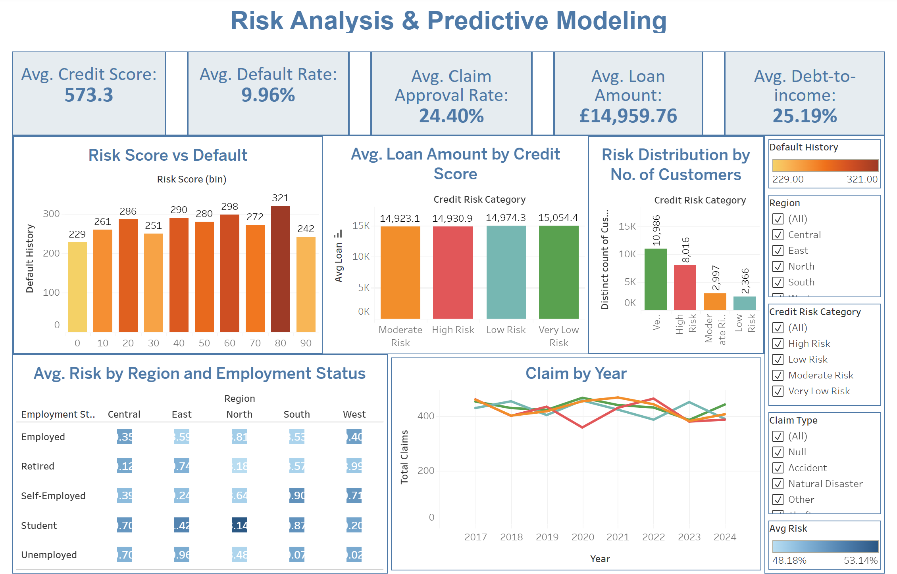

# Customer Risk Analysis Project

## Project Description
This project analyzes customer, financial, and claim data to understand risk segmentation, credit behavior, and claim patterns. It demonstrates data cleaning, feature engineering, SQL analysis, and visualizations to help make informed business decisions.  

Key objectives include:
- Merge and clean multiple datasets (customers, financials, claims)
- Feature engineering: debt-to-income ratio, risk category
- Risk segmentation across regions and employment types
- Analysis of defaults and claims
- Interactive visualizations of key metrics

---

## Dataset
- **Customer Data:** 20,000 records, includes age, income, employment status, region, and signup date  
- **Financial Data:** 20,000 loan records, includes loan amount, credit score, late payments, risk scores, and history  
- **Claims Data:** 20,000 claim records, includes claim amount, type, status, and incident date  

**Folder Structure:**
00_Data/
00_raw/ # Original datasets
01_clean/ # Cleaned datasets
01_python/ # Python scripts for data cleaning and feature engineering
02_sql/ # SQL queries and scripts for analysis
03_visualization/ # Visualization scripts

---

## Steps Performed

### 1. Data Cleaning & Merging (Python)
- Read and combined multiple CSV files using `pandas.concat`
- Converted date fields to `datetime`
- Checked for duplicates, invalid ages, negative values
- Identified and handled outliers for `income`, `loan_amount`, and `claim_amount`
- Feature engineering:
  - `debt_to_income_ratio` and `dti_category`
  - `multiple_loans` flag
  - `risk_category` derived from `risk_score`
- Saved cleaned datasets to `01_clean/`  

---

### 2. SQL Analysis
- Loaded merged dataset into MYSQL (`risk_analysis.db`)  
- Queries performed:
  1. **Risk Segmentation:** Count of high, medium, and low risk customers by region and employment type  
  2. **Credit Band Analysis:** Average loan and claim amounts by credit score bands  
  3. **Default Rates:** Default percentage by claim type and employment status  
  4. **High-Risk Claims:** Count of high-risk customers by claim status  

---

### 3. Visualization
- **Regional Risk by Employment Type Heatmap:** Visualized risk distribution across regions  
- **Time-Series of Claim Types:** Trends of claim types over years  
- **Risk Score vs Default:** Bar Chart to show relationship
- **Credit Score vs Default:** Bar Chart to show relationship
- **No. of customers by Risk status:** Bar chart of no. of default customers  

## Tools used:
- Python (pandas, numpy, matplotlib, seaborn)
- SQL (MySQL)
- Excel (for inspection if needed)
- Tableau
  
---
Tableau Public Link: [View Dashboard](https://public.tableau.com/app/profile/viijeta.r/viz/Risk_Analysis_17564266615830/Dashboard1)

Screenshot Preview: 

## Sample Insights
- Highest default rate among students and self-employed customers
- Debt-to-income ratio helps identify high-risk customers
- Regional risk patterns highlight areas needing stricter monitoring
- Certain claim types (Theft) have higher default association  

---

## How to Use
1. Clone or download the repository
2. Use Python scripts in `01_python/` to process raw datasets in `00_Data/00_raw/`
3. Load `master_dataset.csv` into MYSQL (`02_sql/`) to run queries
4. Use visualization scripts in `03_visualization/` to generate charts  

---

## Files Included
- Cleaned datasets: `00_Data/01_clean/`
- Python scripts: `01_python/`
- SQL queries: `02_sql/`
- Visualization scripts: `03_visualization/`
- Final merged dataset: `master_dataset.csv`

---

## Author
**Vijeta Singh Rajput**  
Tools: Python | SQL | Tableau | Power BI | Excel  
[LinkedIn](https://www.linkedin.com/in/viijetar/)
